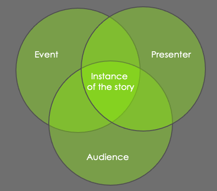

# Mentoring New Speakers
*5 exercises to create meaningful talks that move people to action*

By [Llewellyn Falco](http://llewellynfalco.blogspot.com/) & [Gillian M Lee]()

<!-- toc -->
## Contents

  * [How to Use this book](#how-to-use-this-book)
    * [Who is this book for?](#who-is-this-book-for)
  * [The importance of practice](#the-importance-of-practice)
  * [1. Give the talk](#1-give-the-talk)
    * [Watch the Talk](#watch-the-talk)
  * [What is the take-a-way of your talk?](#what-is-the-take-a-way-of-your-talk)
  * [The importance of Stories](#the-importance-of-stories)
  * [2. Story or Summary](#2-story-or-summary)
    * [Steps](#steps)
    * [Story vs. Summary](#story-vs-summary)
  * [Being true to the story - not the facts](#being-true-to-the-story---not-the-facts)
  * [Your Specifics](#your-specifics)
  * [3. Timing exercises - (1, 5, 50)](#3-timing-exercises---1-5-50)
    * [Assumptions and adjustments](#assumptions-and-adjustments)
    * [#1 The one-minute talk](#1-the-one-minute-talk)
    * [#2 The five-minute talk](#2-the-five-minute-talk)
    * [#3 The fifty-minute talk, one slide of](#3-the-fifty-minute-talk-one-slide-of)
    * [The importance of clocks](#the-importance-of-clocks)
  * [Setting/Character/Plot/Conflict/Resolution](#settingcharacterplotconflictresolution)
  * [Role PLaying - Using emotion in your story](#role-playing---using-emotion-in-your-story)
    * [Developing your character's characteristics](#developing-your-characters-characteristics)
  * [Two Person Talks](#two-person-talks)
    * [Modeling exercises](#modeling-exercises)
    * [Advantages of two-person talks](#advantages-of-two-person-talks)
  * [Tips for Podcasts / Interviews](#tips-for-podcasts--interviews)
  * [Event Driven Practice](#event-driven-practice)
  * [Appendix A: Short Reference](#appendix-a-short-reference)
    * [Special Thanks](#special-thanks)
  * [Slides](#slides)<!-- endToc -->

## How to Use this book

This book is a collection of the most common exercises I use to help mentor new speakers.

[//]: # goto is software-specific. If you want this to be relevant to a wider audience, you may want to use a more widely-understood example. As someone who writes code though, I enjoy the reference :-)
Who am I?  I'm Llewellyn Falco. I've been a technical speaker for two decades and have given thousands of presentations across the USA and Europe. I've also mentored a few new speakers and in that process, I've started to notice a few 'goto' activities I use with them to help them find their voice and improve their presentation. The purpose of this book is to give you much of the same benefits of working with me on your own.

My co-author is Gillian M Lee. She is an author and speaker and one of the people I helped mentor in her speaking journey. Besides her obvious help in making this text readable, Gillian is here to be an advocate for the new speakers reading this. Not only to keep me honest, but also to ensure that these exercises are understandable and complete. 

Together, we hope we can give you some practical tips to help make your talks more meaningful to your audience and more relaxing and fun for you to deliver.

We suggest you start by going through these sections in order the first time, and then pick and choose as you revisit the exercises later. Because the value you get from the book will be in the **doing of the exercises**, we also suggest that you do this book in small parts, rather than one big long read. This will help you to have the energy needed to put into each exercise. Llewellyn would never do all these exercises with someone he's mentoring in one session.

### Who is this book for? 

[//]: # "Comment: I love this section, it reminds me of Emily's writing. Short, to the point, but eloquent"
This book is for anyone who wants to speak with more confidence and change the way people act as a result of their presentation. 

It is also for people who are mentoring new speakers themselves and would like some guidance on what to do, and what exercises might fix the problems that they are detecting. Many times the mentor knows what's wrong. It is obvious to them, however, getting the new person to walk a path to the solution may be difficult. 

[//]: # The connection of this section to the previous one isn't explicit. Is there something you could add to make it more clear?
When Llewellyn started mentoring people, he would say,  
"You need to tell a story "
And they would reply, "I *am* telling a story." 

 The exercises we have collected here helped him to get them to move. Whether for your own presentation, or for someone you are mentoring, we hope they can help you do the same.
 
## The importance of practice

## 1. Give the talk
[//]: # "Comment: I am never ready to do this is written in Gillian's voice, but it isn't clear that we've switched POV from we to Gillian. Make the switch explicit". This is still an issue.
The very first thing that Llewellyn has people do when they ask him to help them with a talk is to ask them to give the talk to him. They are never ready to do this. I am never ready to do this. That's ok. Our goal is not to give a good talk. It is only to give a talk. Doing this will force something to come out of your mouth. And then we can start to work on that. 

[//]: # Zoom shouldn't be quoted
We are going to record this first attempt. It doesn't matter if it only lasts five minutes for an hour-long session; we need to capture something. And we are going to want to be able to review it. Usually, Llewellyn simply uses his phone for this, or if on 'Zoom' he will hit the record button. These recordings are not permanent and are deleted immediately after watching them.

**note:** If the person is extremely nervous about being recorded. I suggest using their phone so that they have complete control over the recording. 

### Watch the Talk

Immediately after giving the first version, watch it together and pay attention to these few things;  
The first is that some of it will be painful to watch. 
> That cringe is the badness leaving your talk.
Nothing is more powerful for removing something you dislike than seeing yourself do it. It can take decades before you can watch yourself without cringing, so be patient.

Next, focus on the pieces that **you liked** from the session. Those are the pieces that you will want to grow. You will get more out of having wonderful pieces in your talk than removing all of the bad. 

Finally, a nice advantage of having it recorded is that you can rewind sections. Sometimes you will say something you wish you had the exact words for and you can grab that from the recording. And other times, you want to revisit a section that is important that wasn't quite expressed correctly. Re-watching sections of a talk is a great way of mining the talk for gems. 

> **Tip:** One advantage of recording your practice sessions is that once you get one you like, you can practice and review simply by watching your recording. This can be very helpful when given a talk again after a few weeks or month. Just put it on and load it into your working memory.

## What is the take-a-way of your talk?
[//]: Notice our own title does not flow with the rest of the sentence.
   One of the first things that new speakers try to do in their talks is pack them full of lessons. Sometimes they do that right away with the title - Ten things I learned from our last project. Although this works great for articles and books, this makes for a very bad spoken session.

   The reason is memory. Someone who sees your talk is almost never going to act on it immediately. Usually, they won't act on it for even weeks or months later when the time is right for them to use what they learned from your talk. 

[//]: Stay consistent with persona. I or you.
   I can't remember ten bullet points two months later. You can remember one important message. So the whole talk needs to be structured around this one thing that you want people to take away.

   Distilling the most important thing is hard! It means getting rid of a lot of things that are genuinely important for the sole purpose of allowing one thing to shine through months later. 
[//]: It would be good to have an example here

## The importance of Stories

One of the best ways to get people to remember things months later is through the power of stories. This is the opposite of how most people structure their talks. They want to summarize what they've learned hoping that they can just share the end result. This would be wonderful if it worked, but it doesn't. 

Everybody has something important to share. Jessica Kerr's advice is to "Give a talk to yourself last year" There are a thousand people who are where you were last year and would appreciate the help and advice. This means they need to hear **your** story. Many of the exercises that follow are about how to figure out and tell **your** story rather than just your bullet points. 

## 2. Story or Summary

Very often, people find it hard to actually tell a story. This exercise (from Kevin Allison's Intro to storytelling course on Udemy) is helpful to move into storytelling.

### Steps
1. Record the story. 
1. Replay one sentence of the story.
    1. Identify if that sentence was a **story** or **summary**
1. Repeat for each sentence.
The power of this exercise is in seeing how much story you have vs summary. For many new speakers, they end up with 100% summary. To be clear, the goal is not to have 100% story. The goal is not 100% but you need it to be more balanced.

[//]: This subtitle is confusing Could you be more specific about how this is different from line 109? Or maybe this should be moved into that section.
### Story vs. Summary

> We were unprepared for the outage.

The above is an example of **summmary** It tells us what happened but doesn't allow us to relive it. If we were to convert it to a **story**, it might sound something like,

> I woke up to the phone ringing at 7am and my boss screaming,   
> No one has been able to place an order since 2am this morning. We've lost over $2.5 million of revenue.

Notice **story** allows you to relive the experience whereas **summary** allows someone who has lived it to remember it. 

[//]: Does this belong under 3 #'s?
## Being true to the story - not the facts

There is an essence of your story which you are trying to convey to your audience. There are also historical facts of your story. Sometimes these can confuse or muddy your story. Sometime these can be in direct conflict. My advice is to prioritize your story and its message. As such, use facts when they are convenient. And disregard them or even make them up when they are not. 

[//]: You may need to provide examples or more details. This sounds like you're telling talkers to be dishonest with their audience if the facts are inconvenient. How is it any different from fake news? You risk your credibility as an author if you don't flesh this out a bit more.

> “Get your facts first, and then you can distort them as much as you please.”
> 
>  ― Mark Twain

## Your Specifics

Pay attention the next time you are reading a book from your favorite author. Notice how many words are involved in the details of the scene. This isn't by accident. The story teller is trying to get you to suspend your disbelief and re-live the story they are telling. 

Almost every business book tells the story of someone at a failing company who tries a new process and ends up turning around the company to outstanding success. It's the specifics of that story that make the book interesting.

It's the specifics of **your story** that allows others to learn from it as if they have gone through it themselves. If you just say what you learned, you remove the chance for them to have those learning be impactful

What will make your story, **yours** is the specifics. What are people's names? What were the details of that argument? Details make the story real, more so than the lesson.   

[//]: # Both of these examples are teargeted to be understood by the same narrow-ish demographic (women between the ages of 20-45, who grew up in secular households in North America or Europe). Reading Twilight, Fifty Shades ofGrey, & watching Pretty Woman was inappropriate/sinful in my church, and my church was pretty mainstream. I did read Twilight and watch Pretty woman after I left the church, but you could be excluding some women or men, or people from other walks of life who aren't as risqué as I was. If you would like to make this more inclusive, It could be good to include stories that are G-rated.

*Twilight and Fifty Shades of Gray are the same story.
*Cinderella and Pretty Woman

What are the details that let you live the story as if you were there? Does it feel real to the person listening? 

 Very often when speakers are trying to tell their story, they make it very generic so that it will fit any listener. Unfortunately, abstract lessons are the opposite of how people learn and not what a speaker should do.

[://]# From the headings and the titles, I feel like everything above this, all the way to section 2 should be 3 #'s or deeper.

## 3. Timing exercises - (1, 5, 50)

Any given instance of a presentation is going to combine three factors:
* The presentation and events that are being told
* The presenter and what they are trying to emphasize in that moment
* The audience and what they are receptive to

  
As such, presentations are different from the script at play. And they are more reactive and involve some improvisation. This means that is very hard to get your timings to work as planned.

Instead, it is better to be able to adjust how you present each section. And be aware of the time. A great exercise to help speakers become comfortable with adjusting their time is to give your presentation at wildly different time scales. Here's how:

[://]# "Something I'm not clear on here: Am I supposed to do this exercise once? Or practise each of these multiple times until I'm really good and happy with the result? Am I supposed to write 3 separate talks on top of the one I have?"

### Assumptions and adjustments
[://] # "It could be good to do this one without a heading."

Many of the first-time speakers that I'm working with are giving ten to twenty minute talks with ten to twenty slides. The following times are based on that structure. If you are giving a much longer or much shorter talk, adjust accordingly. Likewise, if you're slide to talk ratio is much different, you will often need to adjust.

### #1 The one-minute talk

This sounds ridiculous but set a one-minute time and try to speed run through your talk. In doing this you will find that you not only shorten explanations but skip entire slides and sections. You also figure out what is the essential core of your presentation.

### #2 The five-minute talk

Like above this is going to be a much quicker than normal telling. It will build on the essential core and give you enough time so that you don't need to cut out sections or slides. This is really helpful when you realize that you are running behind while onstage.

### #3 The fifty-minute talk, one slide of
[://] # "This title doesn't tell me much, maybe something like 5 minutes per slide?"

Here we want to work on really delving into each slide. But we don't want to take fifty minutes to do the whole talk. So pick a slide randomly from the deck and set a five-minute timer for just that slide. It's best if the slide is smaller. So that you really have to pull out details and depth. This is great for when you have more time or you realize that you need more focus in this area for this audience.

### The importance of clocks 

Now that you have stretched your talk to its limits and compressed it to its essence, you can safely adjust the length on the fly during the presentation.

To do this, you will need some sort of clock plus an idea of where you would like to be in your presentation at key intervals. This way, you can tell if you are running fast or slow, and adjust accordingly. This means you want to know you need to speed up 13 minutes in, not find out 5 minutes before the end that you need to cut off the end of the story. 

If you are presenting remotely, you will need a clock or count-down timer in your office, visible while you are looking at your camera. If you are presenting in person, you should assume that this will not be provided. Instead set up a count down timer on your phone or tablet. And bring a stand or a holder so you can make it visible to you from the stage. 

For example, I go on stage at 10:18 for my 10:30 talk which is set to last 30 minutes. I immediately pull out my iPad and set the count down timer for 42 minutes and start it. I place it on the side of the stage, visible to me. I know that when it gets down to thirty minutes, I need to start my presentation. When it hits zero, I need to be done.  

## Setting/Character/Plot/Conflict/Resolution
[://] # "I feel like this section belongs with the story section, though I'm not sure what you'll put here"

TODO: start here

## Role Playing - Using emotion in your story
[://] # "I also feel like this section belongs with the story section"

If you are telling a sad story, but you yourself are not sad, your audience won't be either. They are going to look to your emotions for cues on how they should feel. This means that if your boss is angry, you need to be using an angry voice. If your team is celebrating, you need to be using a happy, excited voice. 

This does not come naturally to new speakers. It means that when you are telling stories in the voices of the characters in your stories, those characters need to have their own voice. This can mean creating accents for them, but more importantly, it means emoting when speaking in their voice. 

Because this feels more appropriate in theatre than a boardroom, it's going to take some practice. 

### Developing your character's characteristics

[://] # "I also feel like this section belongs with the story section"
[://] # "This example illustrates things really well, but this section doesn't feel finished. I'll leave the comments for now"

For example, one of our characters was Bob the salesman. 

"What's Bob like?" I asked. 

"Oh, he's big and boisterous. Whenever he talks , he waves his hands around alot. And he like to make statements like 'This is going to be the best ever!' He's very different than Suzie. 

"Oh, What's Suzie like?"

"Suzie is shy and demure. She is small and she makes herself even smaller by hunching her shoulders. When she talks, you can barely hear her voice. And it feels like she's always apologizing."

You need your characters to come to life. This means that they need to have a personality. This doesn't have to mirror their actual personality. It can be a heightened or exaggerated version or you can make it up completely for dramatic effect. But they have to have a personality. 

Once you've fleshed out their personalities, you're going to need to practice role playing them. This is really simple. 

Take a single character and start by just having them say the parts of their story in their voices. It will feel silly at first, but with practice, it will feel more natural to say their parts of the story in their voice than not to.

## Two Person Talks

[://]# "This should be section number 4"

There are many advantages to giving a talk with a co-presenter. Unfortunately, many people approach this as a way of dividing a talk into two sections, one for each speaker. Often they will interleave these sections to make it less obvious, but this is not a good technique for a two person talk. The rule that I try to follow is this. 

[://] # "Why? I hear your opinion here, but what makes this better? What is behind your reasoning?"

>A two person talk should not be able to be delivered by a single person.

A great example of a two person presentation is the skit "Who's on first? What's on second?" by Abbott and Costello. First, this follows the rule that this couldn't be done by just Abbott or just Castello. It also takes advantage of each personality to play off each other. Finally they are talking to each other, instead of each of them taking turns talking to the audience. 

This final difference is one of the major differences between a one person talk and two-person talk. In a one-person talk, you have to talk to the audience. If there are two people, they should be talking to each other and the audience is overhearing that conversation. 

### Modeling exercises
[://] # "I don't think this header is needed unless you intend to flesh this out more"

A great way to help prepare for this type of talk is to watch other people who do it well. Talk shows can be a great example of this. Pay attention to how they ask each other questions, how they react to each other, even how they contradict each other to make a point. Be aware that the host often asks questions that they already know the answer to, for the benefit of the audience.  

### Advantages of two-person talks

* The other person can praise you in a much more credible way
* One person can play devil's advocate or offer resistance. The changing of the co-presenter's opinion can make it easier for people in the audience to change their opinion
* One person can offer common misconceptions giving you a chance to clear them up. 

In many presentations, the audience shows up with their own opinions pre-formed. You aren't just providing information, you are trying to change their minds. 

If you only present your model of the world, the audience will  
autocorrect what you said to match their model of the world. Even presenting clear evidence to the contrary can have a [backfire effect](https://theoatmeal.com/comics/believe) that makes someone even more resistant to your ideas.

With two people you have them represent their model of the world
And show how the model breaks down
And it can be easier for them to change their minds. Instead of thinking I would have never made that mistake
[Changing minds](https://www.youtube.com/watch?v=eVtCO84MDj8)

[://] # "I love this advantages section. Nicely done!"

## Tips for Podcasts / Interviews

[://] # "Could you maybe have a section titled "Tips" that the following sections could be under?"

It's surprising how many interviews are hard to remember a half hour later. This is mainly because of an unfortunate pattern that is done in the interview process. The pattern is that the person being interviewed will be asked a direct question by the interviewer, and they will answer that question.

For example:

Interviewer: "What's your favorite food?"

Interviewee: "The cake I had in Milan"

Interviewer: "What made it so great?"

Interviewee: "It had this combination of sugar and cinnamon tha ran through the crust as well as over, and it was delightful"

It's totally natural to respond to a questions with an answer, but it makes for a bad interview. What you need to do is to respond to a question with a story.

Interviewee: "I need to tell you about this time I was in Milan. We were late getting in. And we just lucked into this cafe. There was this aroma of chocolate and coffee that hits you as you walk through the door. We got coffee too start, but we couldn't start looking at the cake. There was the crunch on the outside and the warm chewiness on the inside. Exactly what we needed for the cold weather. And we changed our thought from we had been dumped off in the city to "this is the best city we could have ended up in "

[://] # "The missing 'r' in this sentence gave the google reader a Boston accent :-P"
The problem with answering questions with stories is that it can be very hard to think about them in the moment of the interview. I have a simple process that lets me get the best out of my interviews rather than "I should have said this.." the next day. 

### 1. Listen to between 2 and 5 previous episodes of a show to get a sense of its patterns 

[://] # "They should ... doesn' t make sense with the previous sentence this could maybe use a bit more fleshing out"
Most listeners listen to many episodes of a broadcast. Some guests have never watched an episode, so they will be surprised. They should know a question is coming, even though the interviewer asks the guests every time. Even a small sampling will give you a sense of what to expect so that you can react appropriately.

### 2. Collect your stories
[://] # "Great analogy, I get an immediate visual"
Your stories are like a deck of cards or a list that you can respond with. Just because you prepared the story doesn't mean that you will tell that story. All you are doing is putting the odds in your favour is that you will have a good story to respond with. You might not tell it, because you never got asked a question that related to it or you thought of a better story to respond with. 

### 3. Flesh our yours stories

There are details that you might need to do some remembering on. For example, when we were in Milan, what was the name of that cafe? Is the person I was with comfortable having their information shared? What is the name of the cake?

### 4. Practice your plug

Often when you're on a show, they will ask if you have anything that you want to share. People are often not prepared for this. Practice a clear concise interesting plug.

## Event Driven Practice
A rule I have for myself is:
> No new talks at international conferences  

[://] # "I thought it was No new talks at conferences?"

This rule gives me a combination of a better talk and a less stressful conference. If I am giving a new talk, I am not enjoying the conference, rather stuck in my room trying to prepare. 

Also the iteration allows me to get the stupid out of my talk. And even after doing this for year, every talk still has a decent amount of stupid in it that needs to get out. 

For some people, there has to be an event for practice to occur.

When you are giving a talk, you are going to need iterations of practice and the easiest way to do that is to schedule them at lower pressure events.  For example, comedians will "break in" jokes at local comedy clubs. You need to do the same thing for your presentation. Here is the ladder of low pressure events. 

Practice your presentation:
1. with two or more friends
2. at work
3. at a local user group or meetup group
4. at a local event
5. at the event you're targeting

[://] # "Starting a sentence with And makes me feel weird. It's not illegal, but this one is a fragment"
Try to get as many iterations as possible before your target event. And try to space them out as much as possible.

Usually the first thing I do when a conference accepts a new talk I'm developing is to schedule my first practice run.

## Changing your talk

One thing that comes up a lot is that in the course of developing your presentation, you might have some huge changes. This is OK. Really. The one thing that you have to stay focused on is that the title of your talk is still a relevant title to what you're presenting. You can take great liberty with the summary and abstract. In the end, your responsibility is that the people who show up to the session have a great experience. If your session doesn't match the title, they'll feel deceived. They probably haven't read your summary or abstract.

## How people choose which talk to attend

I believe that people choose which talk to attend in the following order:

1. who is presenting: This is completely pass/fail. The Beatles are playing? I'm going. Someone I haven't heard of? Their name makes no effect. 
1. the topic: Otherwise, I'm mainly going to reject by topic. I'm going to sort possibilities by things I'm interested in and things I'm not interested in. 
1. level: Mostly, the more introductory the level, the more likely I'm going to want to see the talk. For example, Getting started with Kubernetes is more appealing than using Kubernetes in Google Cloud native for security enhancements. Examples of entry level titles include: 
** Getting started with..., Intro to..., ... for beginners,...101
1. your competition: You are going up against the Beatles? People aren't showing up to your talk.
[://] # "The examples in point 3 would be better as concrete examples, separated by line, with the relevant points bolded. I did it above as an example

### A Clear Title
You have no control over any of the things other than #2. Make sure the person coming to your talk can understand the topic of the talk from the title. What you don't want is someone to say, "I wish I knew that was being talked about. I would have loved to see it."

The person who is presenting a talk may be the worst person to pick the title. They're typically inclined to pick something clever that makes sense after you've seen the talk. What you want is a title that is clear to someone who is not familiar with the talk. Here are two methods to achieve this. 

#### 1. Ask the audience what the title should be

When you are doing one of you practice sessions, ask the audience to all write down what they think the title of the talk should be. Whatever the majority says, should probably be the title. 

#### 2. Survey for clarity

Alternatively, you can ask people who do not know what the talk is about what they think the talk is about based only on the title. Don't argue with them. Change the titles when you don't hear what you expect.  Repeat until the title and survey do match.

## Appendix A: Short Reference

# Short Reference <!-- include: ShortReference.md -->

todo: capture all the callouts here.... <!-- endInclude -->

### Special Thanks
Many people helped proofread and offered advice in the creation of this book. Thank you to each and everyone one:
* Nazee Hajebi

Maybe not:
___
## Slides
* Props
* Contrast - data & diffence
